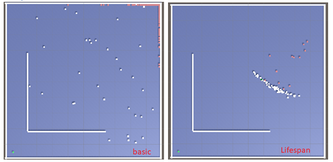
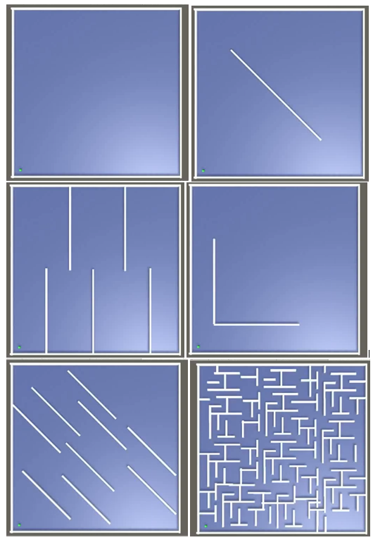
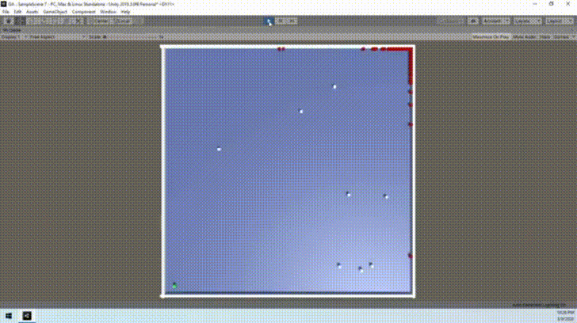

# genetic-algorithm-unity
The game is that the player in the maze must find the shortest path to the goal. The player’s character is a simple cube, and his goal is a green cube which is located at the other end of the map. To compare the algorithm in different scenarios, mazes were created for different levels of difficulty. 

Algorithm implementations began with creating a player population that will evolve with each future generation. The size of the population is set in advance at the start of the game in-game code. The next step was to create a function for each player, that will assess the quality of player tasks based on the player distance from the goal (called Fitness Function). The closer the player is to the target, the better the score he will get. The new generation begins when the first player reaches the goal or all players complete their moves or just die. The status for each player of the population should be constantly monitored. At the moment when generation ends, it is time for the algorithm to start work. So, another function has been created, that starts to sum the players' results. The next stage of implementation was to create a function that was called "Natural Selection". Inside this function, some other functions have been implemented. One of them is the method, which has the ability to choose one parent based on the player's score for further reproduction (each parent for each player). Another function, in turn, is a function that will create offspring based on the parent. This function copies the brain of the parent into the newly created player (child) brain. This function skips the best player, called "champion". The old list of players is replaced by the new one returned by the function. It was necessary to ensure that old objects were removed from the game. The last function concerned mutations of newly created players. Based on the ratio (2%) specified in the function, motion vectors were replaced for new random for each new player in order to provide new genes to the environment. At this stage, it was necessary to add new functionality to the function responsible for calculating fitness, namely for players who achieved their goal, the calculation is different. The result is calculated based on their number of moves - not on the distance (equal to 0). In this way, the algorithm was finished and ready for the first tests.

It is impossible to compare the basic version of the algorithm with the lifespan version by comparing the number of generations because the generations in "lifespan" are shorter and their time increases with the increase of the lifespan value. Measuring the time needed to reach the goal in the simplest maze, the time is extended due to the progressive extension of the genome to such a level at which the player is able to reach the goal. Therefore, the study was mainly based on observation and finding differences between the two games.

The algorithm always generates a different set of genomes (vectors) with each new start-up, which always evolve in a different way. This means that the algorithm never works the same, and each solution can be similar or completely different. The advantage is that the algorithm does not have a constant mental flow and does not follow beaten paths. The result is the possibility of achieving several different optimal solutions as an output. The algorithm is great at optimizing the path, along with the increase in the generation the path length becomes shorter. The genetic algorithm seems to be a good solution as a method of optimizing a problem for which we are unable to find a specific solution or algorithm. Therefore, replacing this algorithm with any pathfinding algorithm would be a better solution, due to obtaining the perfect solution compared to the optimal solution that genetic algorithm provides

## Preview
### Implemented mazes

### Finding goal cube with basic maze

